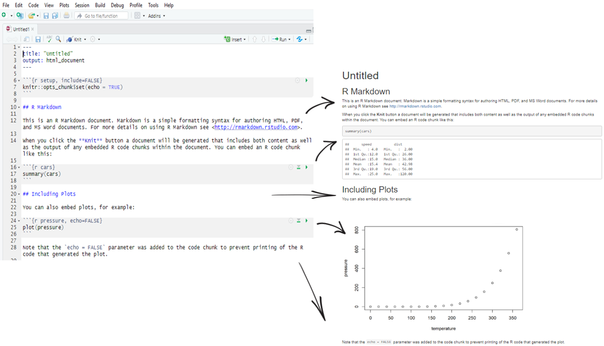

```{r setup, include=FALSE}
knitr::opts_chunk$set(echo = TRUE)
```

# Comandos para la tabla de contenidos (_toc_)

- Presionar **t** para mostrar u ocultar la _toc_ .

<br>

- Presionar **s** para mostrar u ocultar la _toc_, tras 
  haberla insertado en el espacio vacío izquierdo que dejan
  estas diapositivas de Xaringan, en caso exista aquel espacio vacío.

---

# Motivación - Rmd

Multiples opciones de publicaciones con RMarkdown:

* Reportes. [Ejemplo](https://rpubs.com/verawaty77/covid_ts)
* Repositorio de conocimientos [Aibnb.](https://www.tandfonline.com/doi/full/10.1080/00031305.2017.1392362?journalCode=utas20)
* Tareas académicas en [Rpubs](https://rpubs.com/).
* Correos personalizados [Mine Çetinkaya-Rundel](https://rmarkdown.rstudio.com/articles_mail_merge.html). 
* Dashboards en [eelloo](https://www.eelloo.nl/wp-content/uploads/2017/08/infographic_Voorbeelden-infographics-Overzicht.pdf).
* Esta página web. 

---

# Objetivos

<!-- 
Themes for slidify: https://codingclubuc3m.rbind.io/post/2019-09-24/
-->

<div style="position: absolute; top: 20; right: 0;">

</div>

- Familiarizarse con el entorno de RStudio para crear reportes.

- Comprender la estructura de un documento R Markdown.

- Comprender los diferentes formatos y los ajustes básicos.

- Aprender los fundamentos de la sintaxis de Markdown.

- Aprender a estructurar un documento .rmd para compilarlo en diferentes formatos.

- Aprender a compartir su documento online en RPubs.

<!--
# 1. Objetivos

## Lo que no haremos:

- LaTeX para compilar documentos pdf: requiere la instalación de una distribución de TeX como [MiKTeX](http://miktex.org/download), [TinyTeX](https://yihui.name/tinytex/)...

- Git y Github para guardar código y compartirlo en línea
 
- **Aprender R!**
-->
 
---

# Lo que necesitamos (como mínimo)

<br>

- [R](https://cran.r-project.org/bin/windows/base/)
- [RStudio](https://rstudio.com/products/rstudio/download/) 
- Paquetes y utilidades de RStudio:
  - [knitr](https://cran.r-project.org/web/packages/knitr/index.html)
  - [R Markdown](https://rmarkdown.rstudio.com/)
  - [Pandoc](https://rmarkdown.rstudio.com/docs/articles/pandoc.html)


---

# **RStudio**  

<br>

- La interfaz básica de **R** no es muy intuitiva. Por esta razón no se usa mucho y se prefiere un *IDE*.

<center>


</center>  

<br>

- Un IDE, *Integrated Development Environment*: un editor de scripts - es un entorno mucho más amigable que facilita el trabajo (gestión de archivos, objetos y comandos, historial de funciones, autocompletado,...)
- El IDE más utilizado es **RStudio** (pero hay otros como **Tinn-R** o **jamovi**).
- Los comandos y funciones son los mismos para **R** y **RStudio**.

---

# Instalación  

1. Descargar e instalar [**R básico**](https://cran.r-project.org/) - Elija su sistema operativo y siga los pasos.

2. Descargar e instalar [**RStudio**](https://www.rstudio.com/products/rstudio/download/#download) (u otra interfaz) - Elija la versión gratuita y su sistema operativo.

3. Verificar si tienes los paquetes (*package*): *rmarkdown* y *knitr* en **RStudio**:

En la consola de R, utilizar lo siguiente:

.scrollable[
```{r}
find.package(c("rmarkdown","knitr"))
```
]

Si no lo tiene, puedes instalarlos con los siguiente comandos. 

En la consola de R, utilizar lo siguiente:
```{r, eval=FALSE}
install.packages("rmarkdown")
install.packages("knitr")
```

<br>

<!--
- A tener en cuenta:

    + No hay actualizaciones automáticas, hay que instalar una nueva versión y volver a descargar los *paquetes* (o mover el directorio de la versión antigua y hacer `update.packages`). **RStudio** se ajustará por defecto a la versión más reciente de la máquina (puede hacerse manualmente). La versión antigua se puede desinstalar. Se recomienda actualizar la versión de R y RStudio anualmente.
    + Algunas utilidades más especializadas pueden requerir la instalación de herramientas adicionales como [*RTools* (Windows) y *LaTeX*](http://cran.r-project.org/doc/manuals/R-admin.html#The-Windows-toolset).
    + Paquete útil para actualizar R y otras herramientas en Windows a través de RStudio: `installr`.
-->

<!--

# ¿Qué es un paquete o *package*? 

<br>

- Un *paquete* es un módulo (o extensión, biblioteca) que contiene un conjunto de funciones (a menudo relacionadas con un método o dominio particular)

- En la instalación, **R** viene con un conjunto de funciones básicas {base} y módulos por defecto (*built-in packages*).

- La comunidad desarrolla constantemente *paquetes* de funciones especializadas.

- Hay más de 15.000 en el sitio web oficial de **R** [CRAN](https://cran.r-project.org/web/packages/). También se pueden encontrar otros en otros lugares (Github, por ejemplo).

- Los paquetes deben ser **descargados** (`install.packages()` o pueden ser instalados a través del menú superior de RStudio *Tools>Install packages...*). Solo es necesario instalarlos una vez; sin embargo, se deberán **cargar** (`library()` o `require()`) cada sesión que se quieran utilizar.

- Una función (por ejemplo, correlación, tablas de contingencia...) puede encontrarse en varios paquetes con variantes más o menos importantes (procedimientos, opciones, argumentos, resultados).

- Los paquetes también deben actualizarse periódicamente. Esto se puede realizar a través de: *Tools>Check for package updates...*.

-->

---

# ¿Qué es R Markdown y por qué utilizarlo?

<!---->

> R + Markdown = RMarkdown

- R Markdown es un paquete instalado por defecto en RStudio.

- Es una herramienta creada para asegurar la **reproducibilidad** de un análisis o una investigación integrando en un único documento el texto en Markdown, el código (R u otro) y los resultados de su análisis.

- Evita todos los pasos de copiar y pegar tablas, gráficos, imágees, y crea documentos o presentaciones fáciles de actualizar en diferentes formatos: word, pdf, ppt, html, etc.

- Está optimizado para la creación de documentos html (formato que se beneficia de las opciones más interesantes).

---

# ¿Qué es R Markdown y por qué utilizarlo?

<br>


---

# ¿Cómo funciona?

R Markdown combina diferentes procesos para crear documentos en diferentes formatos a partir de un único archivo:

<center>

</center>

---

# ¿Cómo funciona?

- Todo comienza con la creación de un documento **.Rmd** en RStudio. Un archivo R Markdown es un simple archivo de texto con una extensión .Rmd (puede crearlo en el Bloc de notas).

- Para generar un reporte, en RStudio utilice el botón knit que activa la función `rmarkdown::render()` y ejecuta los bloques de código en el archivo **.Rmd** para incluirlos en el documento final. Estos resultados se convierten en un archivo temporal .md (que contiene el código y los resultados).


<!--
- Este es un bloque de código para compilar un documento y establecer el formato de salida con el argumento *output_format* de la función `render`:

```{r, eval=FALSE}
library(rmarkdown)
render("1-example.Rmd", output_format = "word_document") 
```

- A continuación, este archivo **.md** es procesado por la herramienta *Pandoc*, que permite convertir el contenido de un lenguaje de marcas (*markup*) en diferentes formatos ("navaja suiza" de la conversión de formatos de documentos). Los parámetros de conversión se especifican en la cabecera **YAML** del documento **.Rmd**, donde entre otras cosas se especifica el formato final.

- Si el formato final deseado es pdf, se añade un paso de procesamiento adicional: *Pandoc* transformará el archivo **.md** en otro archivo intermedio .tex. Este archivo .tex será luego procesado por *LaTeX* en su forma final de pdf. 
-->

<!-- 
- Tenga en cuenta que *LaTeX* es una herramienta muy poderosa para estructurar documentos, pero esta personalización específica para pdf significa que se pierde la flexibilidad multiformato de Markdown.
-->

---

# ¿Cómo creo un nuevo Rmd?

Creación de un Rmd en RStudio `r emo::ji("hatching_chick")`:


`r emo::ji("woman_technologist")` `r emo::ji("man_technologist")` Ejercicio 1: Crear y compilar un Rmd

---

# Formatos de salida

1. **Formatos de documentos:**
    - html_document
    - odt_document
    - rtf_document
    - word_document
    - github_document
    - md_document
    - pdf_document  (LaTeX/pdf)
    - latex_document (LaTeX/pdf)
    - beamer_presentation (LaTeX/pdf)
    
2. **Formatos de presentación:**
    - ioslides_presentation (*slides html*)
    - slidy_presentation (*slides html*)
    - revealjs::revealjs_presentation (*slides html + js*)
    - powerpoint_presentation 

---

# Formatos de salida

**Opcional:**
Para crear archivos PDF utilizando RMarkdown, necesitaremos tener instalado una distribución de LaTeX. Si no tienes instalado LateX, recomendamos instalar [TinyTeX](https://yihui.org/tinytex/).

En la consola de R, utilizar lo siguiente:

```{r, eval=FALSE}
install.packages('tinytex')
tinytex::install_tinytex()  # Instala TinyTeX
```

TinyTex es una distribución ligera de LaTex. Sin embargo, esta instalación podría demorar según tu conexión a internet.

---

# Formatos de salida

Hay un gran número de *paquetes* y *plantillas* para crear diferentes tipos de documentos con una amplia variedad de estilos predefinidos: plantillas de presentación, artículos periodísticos, libros, tesis, sitios web, blogs, widgets, cuadros de mando, mapas y otras presentaciones interactivas...

  - Ver [galeria](https://rmarkdown.rstudio.com/gallery.html)
  - Algunos  de los más conocidos:
    -  [prettydoc](https://github.com/yixuan/prettydoc/)
    -  [bookdown](https://bookdown.org/yihui/bookdown/)
    -  [blogdown](https://bookdown.org/yihui/blogdown/)
    -  [distill](https://github.com/rstudio/distill)
    -  [xaringan](https://bookdown.org/yihui/rmarkdown/xaringan-format.html)
    -  [flexdashboard](https://rmarkdown.rstudio.com/flexdashboard/)
    -  [rmdshower](http://mangothecat.github.io/rmdshower/skeleton.html)
    -  [vitae](https://github.com/mitchelloharawild/vitae)

- Hay que tener en cuenta que el uso de estas diferentes herramientas requiere el aprendizaje de una configuración/etiquetado particular que puede ir en detrimento de la interoperabilidad de los formatos.

- También puede crear sus propias [plantillas](https://rstudio.github.io/rstudio-extensions/rmarkdown_templates.html) y [estilo de documento](https://bookdown.org/yihui/rmarkdown/word-document.html)
  
`r emo::ji("woman_technologist")` `r emo::ji("man_technologist")` Ejercicio 2: añadir un tema de [prettydoc](https://github.com/yixuan/prettydoc/) al Rmd.
 
---

# Estructura de un documento RMarkdown

Contiene 3 partes:

  1. Un encabezado de metadatos (*encabezado YAML*): encabezado escrito en [**YAML**](https://en.wikipedia.org/wiki/YAML) rodeado por 3 guiones.
  2. Texto: formateado en markdown.
  3. Bloques de código:<br>
    *códigos* encerrados entre triple tilde invertida (acentos agudos) 
  
  ````text
  ```
  ````
  (Para crearlos rapidamente se puede usar *ctrl +alt + i*).
 


---

# Estructura de un documento RMarkdown

<p style="margin-bottom: -20px;"> &nbsp; </p>



---

# Metadatos

- Metadatos básicos y campos de Ouput para definir el formato y sus opciones para configurar la presentación final
- Sintaxis [YAML](https://en.wikipedia.org/wiki/YAML) 


- Cada [formato de salida](https://rmarkdown.rstudio.com/formats.html) tiene opciones específicas para personalizar la presentación final con argumentos como subvalores del campo *output*: (las subopciones deben estar con sangría).
- Para saber cuáles son estas opciones, consultar la ayuda: `?rmarkdown::html_document`.
- Si un formato de salida es proporcionado por un paquete en específico, debe ser nombrado en el campo YAML `output: tufte::tufte_html`.

---

# Metadatos

También es posible controlar el formato del documento final utilizando las opciones del menú **knit** de RStudio. El encabezado YAML se modificarán automáticamente.


---

# Texto con formato Markdown

## Sobre Markdown

- [Markdown](https://daringfireball.net/projects/markdown/syntax) es un lenguaje de marcado, una versión simplificada de html, creado por John Gruber en 2004.

- Se utiliza para estructurar contenidos textuales y producir documentos a partir de texto plano etiquetado.

>Markdown refleja la filosofía del estoicismo: el "mundo natural" consiste en texto plano, y no hay que dejarse controlar por el deseo de placer (visual). 
> --- [Yihui](https://bookdown.org/yihui/rmarkdown-cookbook/formatting.html)

- A menudo se compara con [LaTeX](https://www.latex-project.org/); otro lenguaje de marcado más potente pero mucho más complejo para producir documentos pdf.

- Existen varias versiones de Markdown desarrolladas por diferentes programadores. La que utiliza [R Markdown](https://rmarkdown.rstudio.com/authoring_pandoc_markdown.html%23raw-tex#pandoc_markdown) es la versión de [Pandoc](https://pandoc.org/MANUAL.html) que también permite convertir los documentos en diferentes formatos.

- Su gran sencillez lo convierte en una herramienta más limitada en cuanto a la estructuración de documentos que el html, LaTeX y los programas de tratamiento de textos. ([Ver Gruber (Creador de )](https://daringfireball.net/projects/markdown/syntax#philosophy))

- Por lo tanto, es útil conocer estos lenguajes (html, css, javascript, LaTeX) si quiere personalizar el formato de sus documentos (pero tenga cuidado porque el uso de html y LaTeX puede causar problemas al exportar a ciertos formatos).

<!--
# Texto formateado en Markdown

## ¿Qué es Markdown?

> Markdown es un lenguaje de marcado (formato más o menos sencillo y fácil de editar) creado en 2004 por John Gruber con la ayuda de Aaron Swartz. Se creó con el objetivo de proporcionar una sintaxis fácil de leer y de escribir. 
 


-->

---

# Texto con formato Markdown 

## Sintaxis básica de Markdown


[Descargar muestra](ejemplos/ejemplo_markdown.Rmd)

[Ver guía intro]()

Más: 

[Tutorial de Markdown](https://www.markdowntutorial.com/)

[Guía de referencia](https://rstudio.com/wp-content/uploads/2015/03/rmarkdown-reference.pdf)


`r emo::ji("woman_technologist")` `r emo::ji("man_technologist")` Ejercicio: Crear un modelo de reporte con las secciones que debes tener para un análisis exploratorio. Por ejemplo: Lectura de datos, Análisis exploratorio univariado, y análisis exploratorio multivariado. Puedes ser creativo con los nombres. 

[Ejemplo de Rmd con sintaxis markdown](ejemplos/ejemplo_markdown_sintax_guiaPrimerosPasos.Rmd)

<!--
# Ejercicio 2 {-}

Comenzar a hacer un CV en Rmd con la librería
[pagedown](https://github.com/rstudio/pagedown).

1. Instalar la librería pagedown. 
     
     `remotes::install_github('rstudio/pagedown')`
    
2. Crear desde modelo: *File>New File>RMarkdown>From Template*
3. Editar títulos y las siguientes secciones:
  - Short bio.
  - Experiencia Profesional.
  - Eduación. 

Otra forma de hacer un CV en Rmd es con la librería [vitae.](https://github.com/mitchelloharawild/vitae). Para esto necesitarás tener instalado $LaTex$ o instalar [Tinytex](https://yihui.org/tinytex/)
-->

---

# Códigos de R (Chunks)

El código R puede incluirse de dos maneras:

1. **En bloques de código** (*chunks*): Estos inician con 
````text
```{r}`r ' '`  
````
, donde r indique el lenguaje a utilizar y se puede emplear otros, como python, sql, ...

.scrollable[
````md
```{r}`r ''`
mean(23, 65, 43, 34, 56) # El estilo de los bloques se define mediante la opción "highlight" en el YAML
```
````
]

- Las etiquetas de bloque se pueden añadir con el botón *insert* o con *Ctrl + Alt + i*.
- Lo mejor es dividir el código que genera diferentes salidas en diferentes bloques

<br>

2. **En el texto** (*Inline R code*) que comienza con ``r`` y termina con un acento  ` `` `. 

**Código: **

```markdown
La edad media de nuestros participantes es `r knitr::inline_expr("mean(23, 65, 21, 22, 26)")`
``` 

**Resultados**: 

La edad media de nuestros participantes es `r mean(23, 65, 21, 22, 26)`.

---

# Códigos de R (Ejemplo)

<!--<div class='left' style='float:left;width:48%'>-->

**Texto Markdown**
  
````md
---
title: "Diamantes"
date: 2021-08-21  #o usar Sys.Date()
output: html_document
---

```{r setup, include = FALSE}`r ' '`
library(ggplot2)
library(dplyr)

smaller <- diamonds %>% 
  filter(carat <= 2.5)
```

Tenemos `r knitr::inline_expr("nrow(diamonds)")` diamantes. Solo 
`r knitr::inline_expr("nrow(diamonds) - nrow(smaller)")` pesan más de 
<span style="color:red"> 2.5 quilates </span>. La distribución del resto es la siguiente:

```{r, echo = FALSE}`r ' '`
smaller %>% 
  ggplot(aes(carat)) + 
  geom_freqpoly(binwidth = 0.1)
```
````

<!--</div>-->

<!--<div class='right' style='float:right;width:48%'>-->
 
**Output**
  
```{r echo=FALSE, out.width='80%'}
knitr::include_url("https://pebiba-taller-rmd.netlify.app/ejemplos/ejemplo_basico_diamantes.html", height = "600px")
```
 
<!--</div>-->

<br>
<br>
<br>

---

# Código R

## Configuración de *chunks*.

- El "comportamiento" de los bloques de código y la presentación de los resultados pueden configurarse de varias maneras.

- Knitr ofrece muchas[opciones](https://rstudio.com/wp-content/uploads/2015/03/rmarkdown-reference.pdf) (*chunck options*) que pueden añadirse como argumentos entre las llaves de cada bloque (cada opción debe estar separada por una coma).

````md
```{r, chunk-label, results='hide', fig.height=4}`r ' '`
```
````

- Cada bloque puede tener opcionalmente un nombre (*etiqueta*), debe ser la primera opción. 

- Estas opciones controlan esencialmente cómo se compila (o no) el código de cada bloque y cómo se presentan (o no) los resultados de cada bloque de código.

- Muchos de los argumentos tienen valores lógicos: TRUE O FALSE (con un valor por defecto que debe ser cambiado si no es apropiado)

- Opciones globales**: Es posible establecer los valores de los argumentos para todos los bloques desde el principio incluyendo el siguiente bloque al principio del documento (por defecto cuando se crea un nuevo archivo .Rmd):


---

# Código R 

## Configuración del funcionamiento de los bloques de código


---

# Código R

<!--
- Para presentar y subrayar fragmentos de código sin ejecutarlos, como si fueran texto, insértelos entre 2 tildes (acento grave):

` r mean(23, 65, 43, 34, 56) `


<br>

Para insertar un texto en un bloque resaltado: añador triple tilde  ``` una línea antes y despues del texto.


```
Texto en un bloque
```

```
        Texto con sangría
```

- De lo contrario, los espacios al principio de una línea nunca se tienen en cuenta

<br>
-->

**Algunos detalles finales: **

- Es mejor añadir una línea en blanco entre diferentes elementos, como un título y un párrafo.

- Para hacer un salto de línea: termine la línea con dos espacios + Enter.

- Para añadir espacios adicionales entre líneas/secciones, utilice la etiqueta html: `<br>`.

- Para incluir comentarios que no saldrán en el documento final, utilice comentarios en html: `<!-- Esto es un comentario -->`.

---

# Más recursos

- Yihui Xie, J. J. Allaire, Garrett Grolemund, 2020-10-14, [R Markdown: The Definitive Guide](https://bookdown.org/yihui/rmarkdown/)


- Yihui Xie, Christophe Dervieux, Emily Riederer, 2020-09-21, [R Markdown Cookbook](https://bookdown.org/yihui/rmarkdown-cookbook/)


- Yihui Xie, [knitr. Elegant, flexible, and fast dynamic report generation with R](https://yihui.org/knitr/)


- [Rmarkdown et RStudio Cheatsheets](https://rstudio.com/resources/cheatsheets/)

- RStudio, [RMarkdown Gallery](https://rmarkdown.rstudio.com/gallery.HTML)

- [Markdown Tutorial](https://www.markdowntutorial.com/)

- Karl Broman, [Writing reproducible reports. knitr with R Markdown](http://kbroman.org/Tools4RR/assets/lectures/03_knitr_Rmd_withnotes.pdf)

- Michael Clark, 2019-11-06, [Introduction to R Markdown](https://m-clark.github.io/Introduction-to-Rmarkdown/)


- Yan Holtz, 10 December 2018, [Pimp my RMD: a few tips for R Markdown](https://holtzy.github.io/Pimp-my-rmd/)


- Alison Hill · Desirée De Leon, [Sharing on Short Notice. HOW TO GET YOUR TEACHING MATERIALS ONLINE WITH R MARKDOWN](https://rstudio-education.github.io/sharing-short-notice/#1)


- [Writing publications with R](http://www.geo.uzh.ch/microsite/reproducible_research/post/rr-r-publication/), Wed, Aug 17, 2016


- Mike Frank & Chris Hartgerink, 2017-07-31, [RMarkdown for writing reproducible scientific papers](https://libscie.github.io/rmarkdown-workshop/handout.html#headers-tables-and-graphs)


- Marian L. Schmidt, May 11th, 2016, [Creating Dynamic Documents with RMarkdown and Knitr](https://rpubs.com/marschmi/RMarkdown)


- Thea Knowles, January 14, 2020, [RMarkdown and Bookdown for Academic Writing in R](https://rpubs.com/thealk/academic-writing)

<br>

**Compartir documentos en línea: **

- [RPubs](https://rpubs.com/) 
- [Netlify](https://app.netlify.com/drop)
- [Github](https://resources.github.com/whitepapers/github-and-rstudio/)
 
---

# Más recursos

 **Guías del curso para aprender Rmarkdown:** 

- [Intro Rmd](https://pebiba-taller-rmd.netlify.app/intro_doc.html#6_Markdown)
- [Personalizar Rmd](personalizar.html)

<br>